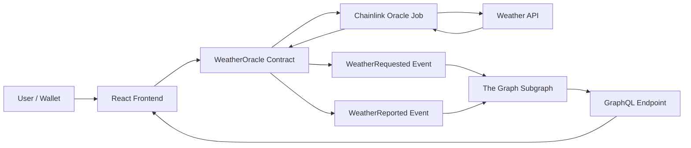
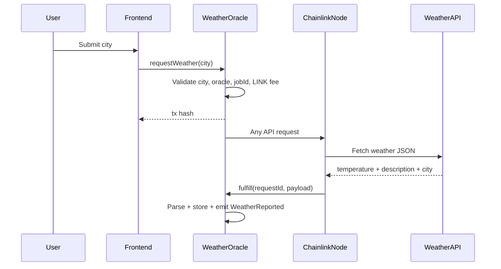
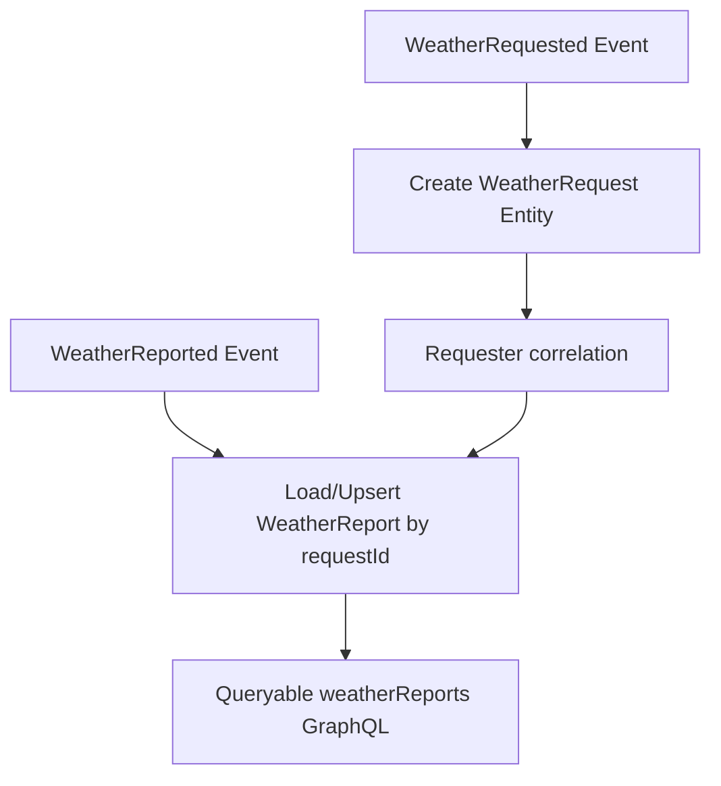
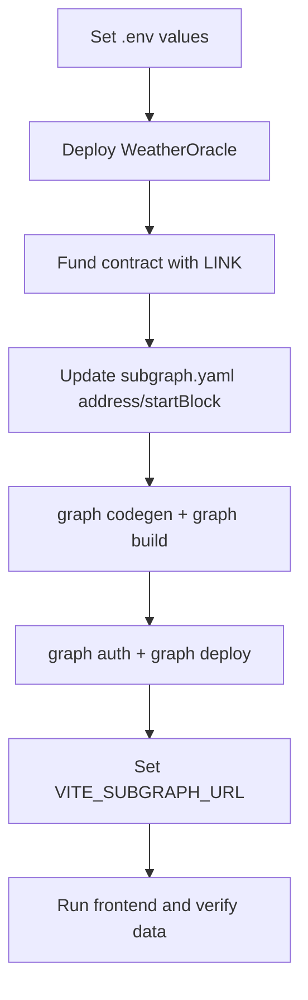

# 🌦️ Decentralized Weather Oracle + Historical Subgraph


A production-ready Web3 weather pipeline that requests off-chain weather data through Chainlink, persists normalized reports on-chain, indexes historical events with The Graph, and exposes everything through a responsive React frontend.

## ✨ Project Overview

This project solves a common dApp challenge: **securely bringing off-chain data on-chain while keeping historical queries efficient**.

It delivers:
- Chainlink Any API request/fulfillment flow in Solidity
- Event-driven storage and indexing strategy
- Queryable historical weather reports via GraphQL
- Frontend for wallet interaction + live indexed report viewing

## 🧰 Tech Stack

- **Blockchain / Contracts:** Solidity, Hardhat, OpenZeppelin, Chainlink Contracts
- **Indexing:** The Graph (Hosted Service or Local Graph Node)
- **Frontend:** React (Vite), Ethers v6, Apollo Client
- **Local Infra:** Docker Compose, Hardhat Node, IPFS, Postgres, Graph Node

## 🗂️ Folder Structure

```text
my-weather-dapp/
├── contracts/
│   ├── WeatherOracle.sol
│   └── mocks/MockLinkToken.sol
├── scripts/
│   ├── deploy.js
│   └── request-weather.js
├── test/
│   └── WeatherOracle.test.js
├── subgraph/
│   ├── schema.graphql
│   ├── subgraph.yaml
│   ├── tsconfig.json
│   ├── package.json
│   └── src/mappings/weather-oracle.ts
├── frontend/
│   ├── .env.example
│   ├── package.json
│   └── src/
│       ├── App.jsx
│       ├── main.jsx
│       ├── contracts/WeatherOracle.json
│       └── components/
│           ├── WeatherForm.jsx
│           └── WeatherReportsList.jsx
├── .env.example
├── README.md
├── architecture.md
├── projectdocumentation.md
├── SECURITY.md
├── docker-compose.yml
├── hardhat.config.js
└── package.json
```

## 🧭 Workflow at a Glance



## ⚙️ Smart Contract Execution Flow



## 📊 Subgraph Data Flow



## 🚀 Local Setup and Installation

### Prerequisites
- Node.js >= 18 (Node 20 recommended)
- npm >= 9
- Docker Desktop
- MetaMask extension

### 1) Configure environment files

```bash
cp .env.example .env
cp frontend/.env.example frontend/.env
```

Populate `.env` with:
- `PRIVATE_KEY`
- `SEPOLIA_RPC_URL`
- `ALCHEMY_API_KEY` or `INFURA_API_KEY` (optional if used to compose RPC URL)
- `LINK_TOKEN_ADDRESS`
- `CHAINLINK_ORACLE_ADDRESS`
- `CHAINLINK_JOB_ID`
- `CHAINLINK_FEE_WEI`
- `WEATHER_ORACLE_CONTRACT_ADDRESS` (after deploy)
- `SUBGRAPH_SLUG`
- `GRAPH_DEPLOY_KEY`

Populate `frontend/.env` with:
- `VITE_CONTRACT_ADDRESS`
- `VITE_SUBGRAPH_URL`

### 2) Install dependencies

```bash
npm install
cd subgraph && npm install
cd ../frontend && npm install
cd ..
```

## 🧪 Run, Build, Test

### Contracts

```bash
npm run compile
npm test
```

Testing strategy summary:
- Unit tests validate request initiation, event emission, LINK balance checks, and access-control restrictions.
- Fulfillment tests validate parser assumptions, report persistence, requester correlation, and emitted weather report events.
- Negative tests validate invalid city, invalid oracle configuration, insufficient LINK, and non-oracle callback rejection.

### Subgraph

```bash
cd subgraph
npm run codegen
npm run build
```

### Frontend

```bash
cd frontend
npm run dev
```

## 🌐 Deployment Flow (Sepolia + Hosted Subgraph)



Deployment commands:

```bash
npm run deploy:sepolia
npm run request:sepolia -- London
```

In `subgraph/`:

```bash
npm run auth
npm run deploy
```

Chainlink configuration notes:
- `CHAINLINK_ORACLE_ADDRESS`: operator/oracle contract used on your target network.
- `CHAINLINK_JOB_ID`: job spec ID configured to return normalized weather payload as string.
- `CHAINLINK_FEE_WEI`: LINK payment amount required for the selected job.
- Ensure the deployed oracle contract is funded with LINK before calling `requestWeather`.

## 📌 Usage Instructions

1. Open frontend (`npm run dev` in `frontend/`).
2. Connect MetaMask.
3. Enter city and submit request.
4. Track tx status in UI.
5. Wait for Chainlink fulfillment and subgraph indexing.
6. See weather report appear in historical list.

## 🐳 Docker Compose Local Environment (Step-by-Step)

1. Start local services:

```bash
docker compose up --build
```

2. Verify service endpoints:
- Hardhat RPC: `http://localhost:8545`
- Graph Node GraphQL: `http://localhost:8000`
- IPFS API: `http://localhost:5001`
- Postgres: `localhost:5432`

3. Stop services:

```bash
docker compose down
```

## 🔎 Example Subgraph Query (GraphQL Playground)

```graphql
query LatestWeatherReports {
	weatherReports(orderBy: timestamp, orderDirection: desc, first: 10) {
		id
		city
		temperature
		description
		timestamp
		requester
	}
}
```

## ✅ Validation Checklist

- [x] Contract tests pass (`10 passing`)
- [x] Subgraph build passes
- [x] Frontend production build passes
- [x] Wallet connect, tx status, and report rendering implemented
- [x] Event-driven indexing and idempotent entity strategy implemented

## 🧱 Key Modules

- `contracts/WeatherOracle.sol`: Chainlink request/fulfill and report persistence
- `subgraph/src/mappings/weather-oracle.ts`: event handlers and entity transformations
- `frontend/src/App.jsx`: wallet/network/account state orchestration
- `frontend/src/components/WeatherForm.jsx`: request submission UX
- `frontend/src/components/WeatherReportsList.jsx`: GraphQL query + report rendering

## 🔐 Reliability Notes

- Owner-gated configuration updates
- Chainlink callback source verification
- Input/config/LINK checks before request dispatch
- Frontend-level loading and error states

## 📎 Required Submission Artifacts

- Public repository link
- Screenshots (frontend + Graph playground query)
- Optional demo video (2–5 min)

Suggested screenshot paths to include in repo:
- `docs/screenshots/frontend-request-flow.png`
- `docs/screenshots/frontend-history-list.png`
- `docs/screenshots/subgraph-playground-query.png`

Optional demo video link section:
- `Demo Video: <Loom/YouTube URL>`

## 📚 Additional Docs

- Detailed architecture: `architecture.md`
- Full technical documentation: `projectdocumentation.md`
- Security checklist: `SECURITY.md`
