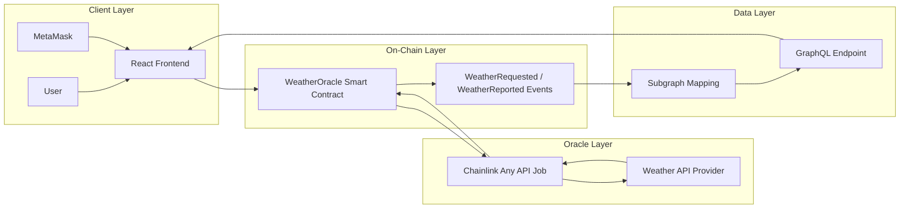
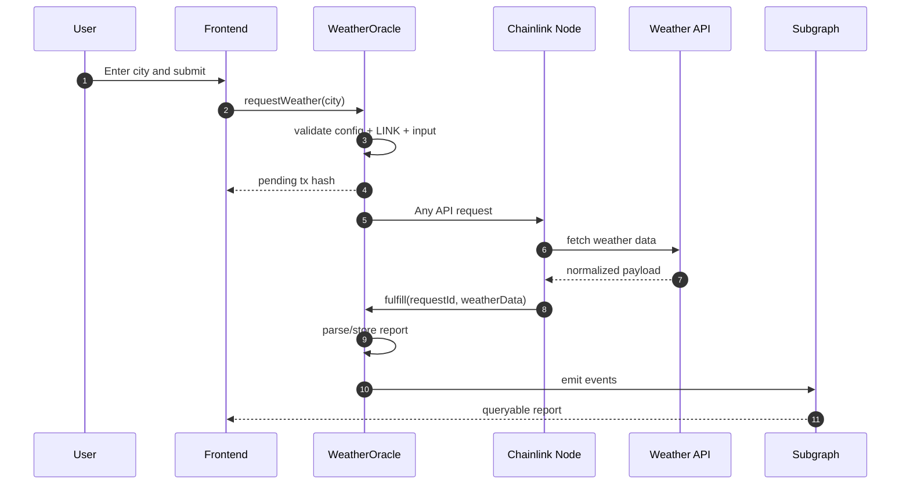
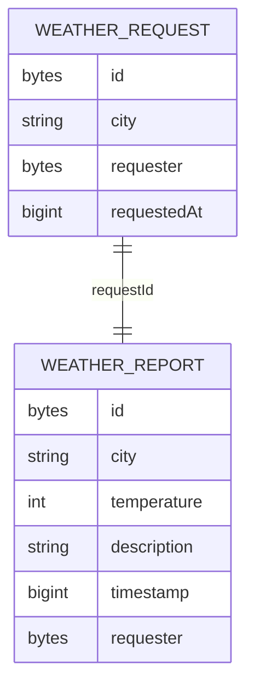
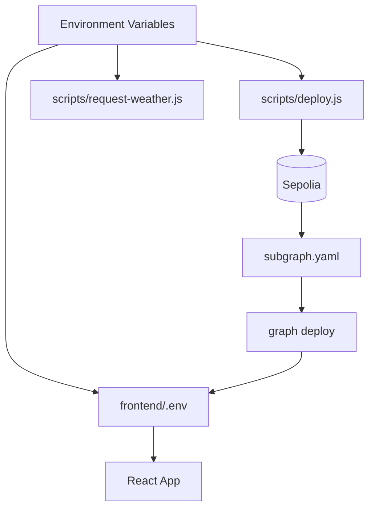

# Architecture Documentation — Decentralized Weather Oracle

## 1) Main Idea and Objective

This architecture is designed to securely bridge off-chain weather information into an on-chain environment, then expose efficient historical querying for users.

Core objective:
- fetch weather data through Chainlink Any API,
- store normalized reports on-chain,
- index historical events through The Graph,
- present request and history workflows in a responsive frontend.

## 2) System Architecture

## 3) Key Modules and Responsibilities

### 3.1 Smart Contract Module

File: `contracts/WeatherOracle.sol`

Responsibilities:
- accept weather request transactions,
- validate city/oracle/job/LINK prerequisites,
- emit request and report events,
- process Chainlink callback data,
- persist report and requester correlation,
- expose owner-only operational controls.

### 3.2 Oracle Integration Module

Responsibilities:
- route request payload to external weather API,
- return simplified JSON response to `fulfill`,
- preserve request ID integrity from request to callback.

### 3.3 Indexing Module

Files:
- `subgraph/schema.graphql`
- `subgraph/src/mappings/weather-oracle.ts`
- `subgraph/subgraph.yaml`

Responsibilities:
- consume emitted events,
- map events to deterministic entities,
- support idempotent processing (`id=requestId`),
- expose queryable weather history to frontend.

### 3.4 Frontend Module

Files:
- `frontend/src/App.jsx`
- `frontend/src/components/WeatherForm.jsx`
- `frontend/src/components/WeatherReportsList.jsx`

Responsibilities:
- connect wallet and signer,
- submit weather requests,
- display transaction states and errors,
- render indexed historical weather reports.

## 4) Execution Workflow

## 5) Data Architecture

### On-chain Storage
- `requestMeta[requestId]` → city + requester reference
- `weatherReports[requestId]` → city, temperature, description, timestamp, requester

### Subgraph Entities
- `WeatherRequest` (request metadata)
- `WeatherReport` (indexed historical report)

## 6) Integration Design

## 7) Problem-Solving Approach

- Use strict precondition checks to fail early.
- Keep on-chain parsing deterministic and bounded.
- Emit event-first records for index-friendly architecture.
- Shift history retrieval to GraphQL layer for scalability.
- Isolate configurations via `.env` to avoid hardcoded secrets.

## 8) Tech Stack Selection Rationale

- **Hardhat:** fast compile/test/deploy workflow.
- **Chainlink:** trusted oracle request/callback model.
- **The Graph:** structured historical data query layer.
- **React + Ethers + Apollo:** simple and maintainable dApp interaction stack.
- **Docker Compose:** reproducible local service orchestration.

## 9) Advantages, Benefits, Pros and Cons

### Advantages / Benefits
- Event-driven architecture improves observability and indexability.
- Historical query workload moved off-chain, reducing contract read pressure.
- Module boundaries are clean and maintainable.

### Pros
- Strong interoperability across contract, indexer, and UI layers.
- Clear upgrade path for additional weather fields and analytics.
- End-to-end validation workflow is straightforward.

### Cons
- Oracle and indexing latency introduces eventual consistency.
- Payload parsing expects adapter format discipline.
- Public deployment depends on external infra availability.

## 10) Scalability and Stability Considerations

- Add pagination and filters for long weather history lists.
- Expand schema for additional attributes (humidity/wind/pressure).
- Add CI checks for contract tests + subgraph build + frontend build.
- Add fallback UI handling for delayed oracle/indexing updates.

## 11) Architecture Quality Checklist

- [x] Clear objective alignment
- [x] Modular architecture boundaries
- [x] Visual system/workflow/data diagrams
- [x] Integration path documented
- [x] Trade-offs and scaling strategy explained
