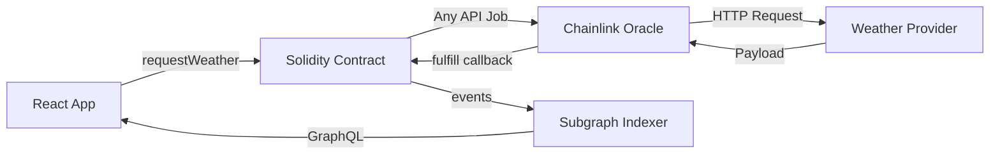
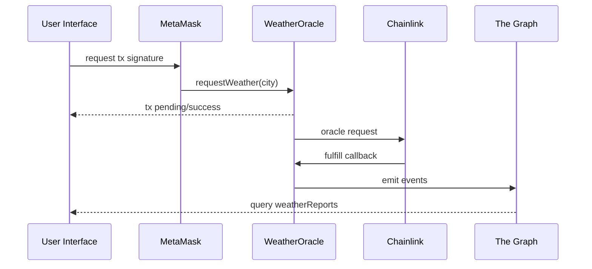
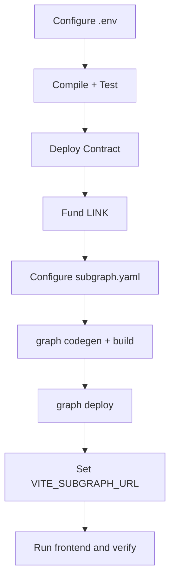

# Project Documentation — Decentralized Weather Oracle + Historical Subgraph

## 1) Main Idea and Objective

This project demonstrates a complete decentralized data pipeline for weather reporting:
1. Request weather data from blockchain via Chainlink Any API.
2. Persist normalized report records on-chain.
3. Index weather history through The Graph.
4. Present data in a responsive frontend for end users.

The goal is to provide a robust reference architecture for dApps that depend on external data feeds with historical query requirements.

## 2) Problem Statement

Directly storing and querying large historical datasets on-chain is expensive and inefficient.
This project solves that by combining:
- **on-chain integrity** for latest/normalized records and event proofs,
- **off-chain indexing** for scalable history queries and frontend responsiveness.

## 3) End-to-End System Design

## 4) Module Responsibilities

### 4.1 Contracts

- `requestWeather(city)`
  - Validates preconditions.
  - Dispatches oracle job.
  - Emits `WeatherRequested`.
- `fulfill(requestId, weatherData)`
  - Validates callback source.
  - Parses temperature/description/city.
  - Persists report.
  - Emits `WeatherReported`.

### 4.2 Scripts

- `scripts/deploy.js`: deploys `WeatherOracle` with env-configurable addresses/fee/job.
- `scripts/request-weather.js`: submits request and prints `requestId` from event logs.

### 4.3 Tests

- Covers success paths and edge cases:
  - empty city,
  - insufficient LINK,
  - invalid oracle/job config,
  - fulfill parser behavior,
  - owner-only restrictions,
  - event verification.

### 4.4 Subgraph

- Tracks request + report lifecycle.
- Correlates requester identity.
- Uses requestId as stable deterministic entity ID.

### 4.5 Frontend

- Wallet connect and chain/account display.
- Request submission with lifecycle feedback.
- Historical report rendering from GraphQL query.

## 5) Technology Choices and Rationale

- **Hardhat**: mature testing/deployment ergonomics.
- **OpenZeppelin**: secure ownership/access-control primitives.
- **Chainlink Any API**: standard decentralized oracle integration model.
- **The Graph**: efficient event indexing and query capability.
- **React + Ethers + Apollo**: lightweight, maintainable dApp frontend stack.
- **Docker Compose**: deterministic local development environment.

## 6) Workflow Explanation

## 7) Deployment Workflow

## 8) Data Flow Details

### Input flow
- User inputs city in frontend.
- Frontend signs transaction and sends to chain.

### Oracle flow
- Contract sends job request to oracle.
- Oracle fetches weather payload and fulfills callback.

### Storage flow
- Contract stores normalized weather report in `weatherReports[requestId]`.

### Index flow
- Subgraph ingests events and materializes entities.

### Query flow
- Frontend queries GraphQL endpoint and renders report history.

## 9) Integration Details

### Contract ↔ Oracle
- Config via `oracle`, `jobId`, `chainlinkFee`.
- Callback guarded by `recordChainlinkFulfillment`.

### Contract ↔ Subgraph
- Event contract:
  - `WeatherRequested(requestId, city, requester)`
  - `WeatherReported(requestId, city, temperature, description, timestamp)`

### Frontend ↔ Contract
- Ethers contract instance from `VITE_CONTRACT_ADDRESS`.

### Frontend ↔ Subgraph
- Apollo client with `VITE_SUBGRAPH_URL`.

## 10) Validation and Verification Strategy

### Automated checks
- Hardhat unit tests for logic and event correctness.
- Subgraph build/codegen validation.
- Frontend production build validation.

### Manual checks
1. Connect wallet and verify account/network display.
2. Submit weather request and inspect tx hash.
3. Verify `WeatherRequested` and `WeatherReported` on explorer.
4. Query subgraph for matching `requestId`.
5. Confirm report appears in frontend list.

## 11) Advantages, Benefits, Pros and Cons

### Benefits
- Decentralized and auditable weather data ingestion path.
- Efficient historical queries without heavy on-chain reads.
- Clear separation between transactional and analytical workloads.

### Pros
- Event-driven architecture is transparent and composable.
- Strong modularity eases maintenance and extension.
- Good developer ergonomics via Hardhat + Vite + Docker.

### Cons
- Oracle/indexing introduces eventual-consistency delay.
- Real-world reliability depends on external adapter/API quality.
- Payload parsing format needs strict adapter conformance.

## 12) Problem-Solving Approach

- Use precondition checks to fail early and clearly.
- Keep on-chain operations bounded and deterministic.
- Emit complete events to support robust indexing.
- Move historical analytics off-chain to GraphQL.
- Use env-based configuration to avoid secret/address hardcoding.

## 13) Operational Readiness Checklist

- [x] Environment templates and documented config values
- [x] Tested core smart contract behavior
- [x] Indexed event model with idempotent handling
- [x] User-facing error/loading handling in frontend
- [x] Local infra bootstrap with Docker Compose
- [x] Documentation with architecture and execution visuals

## 14) Future Enhancements

- Add retries/circuit-breaker logic around frontend polling.
- Add request status entity and detailed oracle diagnostics in subgraph.
- Add richer weather schema (humidity, wind speed, pressure).
- Add UI filtering and pagination for large historical datasets.
- Add CI pipeline for test/build/doc checks.
